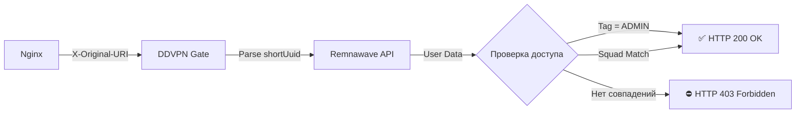

<div align="center">

# 🔐 DDVPN Gate

### Микросервис авторизации для защиты подписок Remnawave

[](https://fastapi.tiangolo.com/)
[](https://www.python.org/)
[](https://www.docker.com/)
[](LICENSE)

</div>

---

## 📋 Описание

**DDVPN Gate** — это легкий и быстрый микросервис авторизации, предназначенный для защиты подписок в системе Remnawave. Работает как `auth_request` модуль для Nginx, обеспечивая гибкий контроль доступа на основе тегов и принадлежности к squad.

### ✨ Ключевые возможности

- 🛡️ **Двухуровневая защита**: проверка по тегам и squad UUID
- ⚡ **Высокая производительность**: асинхронная обработка запросов
- 🔌 **Простая интеграция**: работает с Nginx через auth_request
- 🐳 **Docker Ready**: готовый образ для быстрого развертывания
- 📊 **Подробное логирование**: отслеживание всех попыток доступа

---

## 🚀 Быстрый старт

### Требования

- Docker & Docker Compose
- Nginx (для интеграции)
- Remnawave API токен

### Установка

1️⃣ **Клонируйте репозиторий:**

```bash
git clone https://github.com/fxfuren/ddvpn-gate.git
cd ddvpn-gate
```

2️⃣ **Создайте файл конфигурации:**

```bash
cp .env.example .env
```

3️⃣ **Настройте переменные окружения в `.env`:**

```env
# URL вашей панели Remnawave (внутри докер-сети используйте http://remnawave:3000)
REMNAWAVE_BASE_URL=http://remnawave:3000

# API Токен (Settings -> API Tokens)
REMNAWAVE_TOKEN=ваш_длинный_токен_jwt

# UUID сквада, которому разрешен доступ (White List)
ALLOWED_SQUAD_ID=00000000-0000-0000-0000-000000000000

# Тег, дающий доступ в обход проверки сквада (по умолчанию ADMIN)
BYPASS_TAG=ADMIN
```

4️⃣ **Запустите сервис:**

```bash
docker-compose up -d --build
```

✅ Сервис будет доступен на `http://127.0.0.1:8099`

---

## 🔧 Логика работы



### Алгоритм проверки доступа:

1. 📥 **Получение запроса**: Принимает заголовок `X-Original-URI` от Nginx
2. 🔍 **Парсинг UUID**: Извлекает `shortUuid` из конца URL
3. 🌐 **API запрос**: Получает данные пользователя через Remnawave API
4. ✅ **Проверка доступа**: Разрешает доступ (HTTP 200), если:
   - У пользователя есть тег `ADMIN` (или другой указанный в `BYPASS_TAG`)
   - **ИЛИ** `externalSquadUuid` пользователя совпадает с `ALLOWED_SQUAD_ID`
5. ⛔ **Запрет доступа**: В противном случае возвращает HTTP 403

---

## 🔗 Интеграция с Nginx

### Базовая конфигурация

Добавьте в ваш конфигурационный файл Nginx:

```nginx
# Основной location для защищенного контента
location / {
    auth_request /_auth_check;
    proxy_pass http://json; # Remnawave Subscription Page
    
    # Дополнительные настройки прокси
    proxy_set_header Host $host;
    proxy_set_header X-Real-IP $remote_addr;
    proxy_set_header X-Forwarded-For $proxy_add_x_forwarded_for;
    proxy_set_header X-Forwarded-Proto $scheme;
}

# Internal location для проверки авторизации
location = /_auth_check {
    internal;
    proxy_pass http://127.0.0.1:8099/auth;
    proxy_pass_request_body off;
    proxy_set_header Content-Length "";
    proxy_set_header X-Original-URI $request_uri;
}
```

### Пример полной конфигурации сервера

```nginx
server {
    listen 80;
    server_name your-domain.com;

    # Health check endpoint (опционально)
    location /health {
        proxy_pass http://127.0.0.1:8099/health;
    }

    # Защищенный контент
    location / {
        auth_request /_auth_check;
        auth_request_set $auth_status $upstream_status;
        
        proxy_pass http://remnawave:3000;
        proxy_set_header Host $host;
        proxy_set_header X-Real-IP $remote_addr;
    }

    # Auth checker
    location = /_auth_check {
        internal;
        proxy_pass http://127.0.0.1:8099/auth;
        proxy_pass_request_body off;
        proxy_set_header Content-Length "";
        proxy_set_header X-Original-URI $request_uri;
    }
}
```

---

## 📁 Структура проекта

```text
ddvpn-gate/
├── app/
│   ├── __init__.py
│   ├── config.py          # Конфигурация приложения
│   └── main.py            # Основной код приложения
├── .env                   # Переменные окружения (создайте сами)
├── .env.example           # Пример конфигурации
├── .gitignore
├── docker-compose.yml     # Docker Compose конфигурация
├── Dockerfile             # Образ Docker
├── README.md              # Документация
└── requirements.txt       # Python зависимости
```

---

## 🛠️ Разработка

### Локальный запуск без Docker

```bash
# Установите зависимости
pip install -r requirements.txt

# Создайте .env файл
cp .env.example .env

# Отредактируйте .env под ваши нужды
nano .env

# Запустите сервер
uvicorn app.main:app --host 0.0.0.0 --port 8000 --reload
```

### Проверка работоспособности

```bash
# Health check
curl http://127.0.0.1:8099/health

# Ответ: {"status": "ok"}
```

### Просмотр логов

```bash
# Docker logs
docker-compose logs -f ddvpn-gate

# Примеры логов:
# ✅ ACCESS GRANTED (Admin Tag): User 'admin_user'
# ✅ ACCESS GRANTED (Squad Match): User 'regular_user'
# ⛔ ACCESS DENIED: User 'unknown_user'
```

---

## 🔒 Безопасность

- 🔑 **API токены**: Храните токены в `.env` и не коммитьте их в репозиторий
- 🔐 **Internal endpoints**: Используйте `internal` директиву в Nginx для `/_auth_check`
- 🌐 **Bind адрес**: По умолчанию сервис привязан к `127.0.0.1`, доступен только локально
- 📝 **Логирование**: Все попытки доступа логируются для аудита

---

## 🐛 Решение проблем

### Сервис не запускается

- Проверьте правильность `.env` файла
- Убедитесь, что порт 8099 не занят другим процессом
- Проверьте логи: `docker-compose logs ddvpn-gate`

### 403 Forbidden для всех пользователей

- Убедитесь, что `REMNAWAVE_TOKEN` действителен
- Проверьте, что `REMNAWAVE_BASE_URL` доступен из контейнера
- Проверьте формат `ALLOWED_SQUAD_ID` (должен быть UUID)

### Nginx не передает заголовок X-Original-URI

- Убедитесь, что используется директива `proxy_set_header X-Original-URI $request_uri;`
- Проверьте синтаксис конфигурации Nginx: `nginx -t`

---

## 📊 API Endpoints

| Endpoint | Метод | Описание |
|----------|-------|----------|
| `/health` | GET | Health check, возвращает статус сервиса |
| `/auth` | GET | Проверка авторизации (используется Nginx) |

---

## 🤝 Вклад в проект

Мы приветствуем ваш вклад! Если у вас есть предложения по улучшению:

1. 🍴 Форкните репозиторий
2. 🔧 Создайте ветку для ваших изменений (`git checkout -b feature/amazing-feature`)
3. 💾 Закоммитьте изменения (`git commit -m 'Add amazing feature'`)
4. 📤 Отправьте изменения в ветку (`git push origin feature/amazing-feature`)
5. 🔀 Откройте Pull Request

---

## 📝 Лицензия

Этот проект распространяется под лицензией MIT. Подробности в файле [LICENSE](LICENSE).

---

## 💬 Поддержка

Если у вас возникли вопросы или проблемы:

- 📧 Создайте [Issue](https://github.com/fxfuren/ddvpn-gate/issues)
- 💬 Обсудите в [Discussions](https://github.com/fxfuren/ddvpn-gate/discussions)

---

<div align="center">

**Создано с ❤️ для сообщества Remnawave**

⭐ Поставьте звезду, если проект был полезен!

</div>
