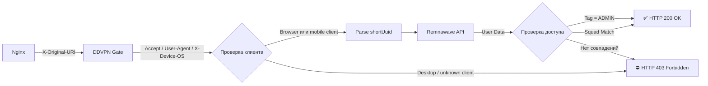

<div align="center">

# 🔐 DDVPN Gate

### Микросервис авторизации для защиты подписок Remnawave

[](https://go.dev/)
[](https://www.docker.com/)
[](LICENSE)

</div>

---

## 📋 Описание

**DDVPN Gate** — это легкий и быстрый микросервис авторизации, написанный на Go, предназначенный для защиты подписок в системе Remnawave. Работает как `auth_request` модуль для Nginx, обеспечивая гибкий контроль доступа на основе тегов и принадлежности к squad.

### 🎯 Для чего создан

Микросервис создан для **защиты дополнительных доменов** и предотвращения несанкционированного доступа. Основная цель — не позволить пользователям получать подписки через альтернативные домены, подменяя адреса.

**Ключевые функции:**

- 🔒 **Защита доменов**: Предотвращает доступ к подпискам через неавторизованные домены
- 👥 **Контроль доступа**: Разграничение по тегам (ADMIN) и принадлежности к squad
- 🛡️ **Безопасность**: Блокирует попытки обхода системы подписок
- 📄 **Гибкость**: Поддержка различных сценариев использования (например, разные страницы подписок)
- ⚡ **Производительность**: Написан на Go для максимальной скорости

### ✨ Ключевые возможности

- 🛡️ **Двухуровневая защита**: проверка по тегам и squad UUID
- ⚡ **Высокая производительность**: написан на Go с минимальным потреблением ресурсов
- 🔌 **Простая интеграция**: работает с Nginx через auth_request
- 🐳 **Docker Ready**: готовый образ для быстрого развертывания
- 📊 **Подробное логирование**: отслеживание всех попыток доступа
- 🔄 **Graceful Shutdown**: корректное завершение работы

---

## 🚀 Быстрый старт

### Требования

- Docker & Docker Compose
- Nginx (для интеграции)
- Remnawave API токен

### Установка

1️⃣ **Клонируйте репозиторий:**

```bash
git clone https://github.com/fxfuren/ddvpn-gate.git
cd ddvpn-gate
```

2️⃣ **Создайте файл конфигурации:**

```bash
cp .env.example .env
```

3️⃣ **Настройте переменные окружения в `.env`:**

```env
# URL вашей панели Remnawave (внутри докер-сети используйте http://remnawave:3000)
REMNAWAVE_BASE_URL=http://remnawave:3000

# API Токен (Settings -> API Tokens)
REMNAWAVE_TOKEN=ваш_длинный_токен_jwt

# Опционально: cookie-доступ к панели (формат key=value)
# Пример для URL вида /auth/login?token=token:
EGAMES_COOKIE=token=token

# UUID сквада, которому разрешен доступ (White List)
ALLOWED_SQUAD_ID=00000000-0000-0000-0000-000000000000

# UUID дефолтного сквада для обычных подписок
DEFAULT_SQUAD_ID=11111111-1111-1111-1111-111111111111

# Тег, дающий доступ в обход проверки сквада (по умолчанию ADMIN)
BYPASS_TAG=ADMIN

# Тег, который разрешает пользователю из ALLOWED_SQUAD_ID открывать подписку с PC
BYPASS_PC_TAG=BYPASS-PC

# Клиентские приложения, которым разрешен доступ только к обходной подписке `/auth`
# Браузеры с Accept: text/html пропускаются отдельно
ALLOWED_CLIENT_APPS=Happ,v2raytun
```

4️⃣ **Запустите сервис:**

```bash
docker-compose up -d --build
```

✅ Сервис будет доступен на `http://127.0.0.1:8099`

---

## 🔧 Логика работы


```mermaid
graph LR
    A[Nginx] -->|X-Original-URI| B[DDVPN Gate]
    B -->|Accept / User-Agent / X-Device-OS| C{Проверка клиента}
    C -->|Browser или mobile client| D[Parse shortUuid]
    C -->|Desktop / unknown client| G[⛔ HTTP 403 Forbidden]
    D --> E[Remnawave API]
    E -->|User Data| F{Проверка доступа}
    F -->|Tag = ADMIN| H[✅ HTTP 200 OK]
    F -->|Squad Match| H
    F -->|Нет совпадений| G
```

### Алгоритм проверки доступа:

1. 📥 **Получение запроса**: Принимает заголовок `X-Original-URI` от Nginx
2. 🛡️ **Проверка клиента**: Только для `/auth` разрешает браузеры (`Accept: text/html`) и мобильные клиенты из `ALLOWED_CLIENT_APPS` на `iOS` или `Android`
3. 🔍 **Парсинг UUID**: Извлекает `shortUuid` из конца URL
4. 🌐 **API запрос**: Получает данные пользователя через Remnawave API
5. ✅ **Проверка доступа**: Разрешает доступ (HTTP 200), если:
   - У пользователя есть тег `ADMIN` (или другой указанный в `BYPASS_TAG`)
   - **ИЛИ** `externalSquadUuid` пользователя совпадает с `ALLOWED_SQUAD_ID`
   - Для PC-клиента дополнительно нужен тег `BYPASS-PC` (или другой указанный в `BYPASS_PC_TAG`)
6. ⛔ **Запрет доступа**: В противном случае возвращает HTTP 403

---

## 🔗 Интеграция с Nginx

### Базовая конфигурация

Добавьте в ваш конфигурационный файл Nginx:

```nginx
# Статические файлы (js, css, изображения) - проксируются без проверки авторизации
location ~* \.(js|css|png|jpg|jpeg|gif|ico|svg|woff|woff2|ttf|eot|json)$ {
    proxy_pass http://json;
    proxy_set_header Host $host;
    proxy_set_header X-Real-IP $remote_addr;
    proxy_set_header X-Forwarded-For $proxy_add_x_forwarded_for;
    proxy_set_header X-Forwarded-Proto $scheme;
}

# Основной location для защищенного контента
location / {
    auth_request /_auth_check;
    proxy_pass http://json; # Remnawave Subscription Page

    # Дополнительные настройки прокси
    proxy_set_header Host $host;
    proxy_set_header X-Real-IP $remote_addr;
    proxy_set_header X-Forwarded-For $proxy_add_x_forwarded_for;
    proxy_set_header X-Forwarded-Proto $scheme;
}

# Internal location для проверки авторизации
location = /_auth_check {
    internal;
    proxy_pass http://ddvpn-gate:8000/auth;
    proxy_pass_request_body off;
    proxy_set_header Content-Length "";
    proxy_set_header X-Original-URI $request_uri;
}
```

### Пример полной конфигурации сервера

```nginx
server {
    listen 80;
    server_name your-domain.com;

    # Health check endpoint (опционально)
    location /health {
        proxy_pass http://127.0.0.1:8099/health;
    }

    # Статические файлы без проверки авторизации (ВАЖНО: должно быть ПЕРЕД location /)
    location ~* \.(js|css|png|jpg|jpeg|gif|ico|svg|woff|woff2|ttf|eot|json)$ {
        proxy_pass http://remnawave:3000;
        proxy_set_header Host $host;
        proxy_set_header X-Real-IP $remote_addr;
        proxy_set_header X-Forwarded-For $proxy_add_x_forwarded_for;
        proxy_set_header X-Forwarded-Proto $scheme;
    }

    # Защищенный контент
    location / {
        auth_request /_auth_check;
        auth_request_set $auth_status $upstream_status;

        proxy_pass http://remnawave:3000;
        proxy_set_header Host $host;
        proxy_set_header X-Real-IP $remote_addr;
        proxy_set_header X-Forwarded-For $proxy_add_x_forwarded_for;
        proxy_set_header X-Forwarded-Proto $scheme;
    }

    # Auth checker
    location = /_auth_check {
        internal;
        proxy_pass http://127.0.0.1:8099/auth;
        proxy_pass_request_body off;
        proxy_set_header Content-Length "";
        proxy_set_header X-Original-URI $request_uri;
    }
}
```

### Несколько доменов без дублирования конфигурации

Если один домен должен проверяться через `/auth` (по `externalSquadUuid`), а другой через `/auth-default` (по `activeInternalSquads` и `DEFAULT_SQUAD_ID`), это можно описать без дублирования `server`-блока.

Разместите `map` в контексте `http`, а не внутри `server`:

```nginx
map $host $ddvpn_auth_path {
    default               /auth;
    whitelist.example.com /auth;
    sub.example.com       /auth-default;
}

server {
    server_name whitelist.example.com sub.example.com;
    listen unix:/dev/shm/nginx.sock ssl proxy_protocol;
    http2 on;

    ssl_certificate "/etc/nginx/ssl/example.com/fullchain.pem";
    ssl_certificate_key "/etc/nginx/ssl/example.com/privkey.pem";
    ssl_trusted_certificate "/etc/nginx/ssl/example.com/fullchain.pem";

    add_header X-Robots-Tag "noindex, nofollow, noarchive, nosnippet, noimageindex" always;

    location ~* \.(js|css|png|jpg|jpeg|gif|ico|svg|woff|woff2|ttf|eot|json)$ {
        proxy_pass http://127.0.0.1:3010;
        proxy_set_header Host $host;
        proxy_set_header X-Real-IP $remote_addr;
        proxy_set_header X-Forwarded-For $proxy_add_x_forwarded_for;
        proxy_set_header X-Forwarded-Proto $scheme;
    }

    location / {
        auth_request /_auth_check;
        proxy_pass http://127.0.0.1:3010;

        proxy_set_header Host $host;
        proxy_set_header X-Real-IP $remote_addr;
        proxy_set_header X-Forwarded-For $proxy_add_x_forwarded_for;
        proxy_set_header X-Forwarded-Proto $scheme;
    }

    location = /_auth_check {
        internal;
        proxy_pass http://127.0.0.1:8099$ddvpn_auth_path;
        proxy_pass_request_body off;
        proxy_set_header Content-Length "";
        proxy_set_header X-Original-URI $request_uri;
    }
}
```

В этом примере:

- `whitelist.example.com` использует `/auth`
- `sub.example.com` использует `/auth-default`
- `127.0.0.1:8099` — это порт хоста, проброшенный к сервису `ddvpn-gate`

## Такой вариант удобен, когда backend у нескольких доменов один и тот же, а отличается только тип проверки доступа.

## 📁 Структура проекта

```text
ddvpn-gate/
├── cmd/
│   └── server/
│       └── main.go            # Точка входа приложения
├── internal/
│   ├── client/
│   │   └── remnawave.go       # Клиент Remnawave API
│   ├── config/
│   │   └── config.go          # Конфигурация приложения
│   ├── handler/
│   │   ├── auth.go            # HTTP обработчики авторизации
│   │   └── health.go          # Health check обработчик
│   ├── logger/
│   │   └── logger.go          # Настройка логирования
│   ├── router/
│   │   └── router.go          # HTTP роутер
│   └── service/
│       ├── auth.go            # Бизнес-логика авторизации
│       └── errors.go          # Определения ошибок
├── .env.example               # Пример конфигурации
├── .gitignore
├── docker-compose.yml         # Docker Compose конфигурация
├── Dockerfile                 # Docker образ
├── go.mod                     # Go модуль
├── go.sum                     # Контрольные суммы зависимостей
└── README.md                  # Документация
```

---

## 🛠️ Разработка

### Локальный запуск без Docker

```bash
# Установите зависимости
go mod download

# Создайте .env файл
cp .env.example .env

# Отредактируйте .env под ваши нужды
nano .env

# Запустите сервер
go run ./cmd/server
```

### Сборка

```bash
# Сборка бинарного файла
go build -o ddvpn-gate ./cmd/server
```

### Проверка работоспособности

```bash
# Health check
curl http://127.0.0.1:8099/health

# Ответ: {"status": "ok"}
```

### Просмотр логов

```bash
# Docker logs
docker-compose logs -f ddvpn-gate

# Примеры логов:
# ✅ ACCESS GRANTED (Admin Tag): User 'admin_user'
# ✅ ACCESS GRANTED (Squad Match): User 'regular_user'
# ⛔ ACCESS DENIED: User 'unknown_user'
```

---

## 🔒 Безопасность

- 🔑 **API токены**: Храните токены в `.env` и не коммитьте их в репозиторий
- 🔐 **Internal endpoints**: Используйте `internal` директиву в Nginx для `/_auth_check`
- 🌐 **Bind адрес**: По умолчанию сервис привязан к `127.0.0.1`, доступен только локально
- 📝 **Логирование**: Все попытки доступа логируются для аудита
- 📱 **Фильтр клиентов**: `ALLOWED_CLIENT_APPS` применяется только к обходной проверке `/auth`

---

## 🐛 Решение проблем

### Сервис не запускается

- Проверьте правильность `.env` файла
- Убедитесь, что порт 8099 не занят другим процессом
- Проверьте логи: `docker-compose logs ddvpn-gate`

### 403 Forbidden для всех пользователей

- Убедитесь, что `REMNAWAVE_TOKEN` действителен
- Проверьте, что `REMNAWAVE_BASE_URL` доступен из контейнера
- Проверьте формат `ALLOWED_SQUAD_ID` (должен быть UUID)
- Проверьте, что приложение входит в `ALLOWED_CLIENT_APPS`
- Проверьте, что клиент отправляет `User-Agent`/`X-Device-OS` с `ios` или `android`

### Nginx не передает заголовок X-Original-URI

- Убедитесь, что используется директива `proxy_set_header X-Original-URI $request_uri;`
- Проверьте синтаксис конфигурации Nginx: `nginx -t`

---

## 📊 API Endpoints

| Endpoint        | Метод | Описание                                                    |
| --------------- | ----- | ----------------------------------------------------------- |
| `/health`       | GET   | Health check, возвращает статус сервиса                     |
| `/auth`         | GET   | Проверка авторизации по external squad (используется Nginx) |
| `/auth-default` | GET   | Проверка авторизации по default internal squad              |

---

## 🤝 Вклад в проект

Мы приветствуем ваш вклад! Если у вас есть предложения по улучшению:

1. 🍴 Форкните репозиторий
2. 🔧 Создайте ветку для ваших изменений (`git checkout -b feature/amazing-feature`)
3. 💾 Закоммитьте изменения (`git commit -m 'Add amazing feature'`)
4. 📤 Отправьте изменения в ветку (`git push origin feature/amazing-feature`)
5. 🔀 Откройте Pull Request

---

## 📝 Лицензия

Этот проект распространяется под лицензией MIT. Подробности в файле [LICENSE](LICENSE).

---

## 💬 Поддержка

Если у вас возникли вопросы или проблемы:

- 📧 Создайте [Issue](https://github.com/fxfuren/ddvpn-gate/issues)
- 💬 Обсудите в [Discussions](https://github.com/fxfuren/ddvpn-gate/discussions)

---

<div align="center">

**Создано с ❤️ для сообщества Remnawave**

⭐ Поставьте звезду, если проект был полезен!

</div>
